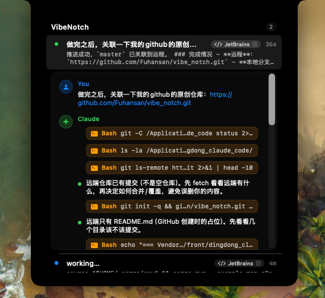

# VibeNotch

> 一个 macOS 刘海屏会话面板 — 把 [Claude Code](https://claude.com/claude-code) 的实时活动可视化在屏幕顶部的"刘海"区域，多终端 / 多会话同时运行也一目了然。



---

## 特性

- **实时会话面板**：通过 Claude Code hooks 接收事件，实时呈现每个会话的当前状态、用户 prompt 摘要、工具调用时间线和助手回复。
- **状态机可视化**：每行左侧一个状态点 — 🟢 完成 / 🔵 运行中 / 🟠 等待用户输入。
- **权限弹窗**：危险工具（`Bash` / `Edit` / `Write` / `MultiEdit` / `WebFetch` 等）调用前直接在刘海里弹出 **Allow / Deny**，无需切到 IDE。
- **终端跳转**：点击会话行直接激活对应的 IDE / 终端窗口。多窗口 IDE（如 PyCharm 同时打开多个项目）会通过 Accessibility 自动匹配到 cwd 所在窗口。
- **文件跳转**：时间线里的 `Edit`/`Read`/`Write` chip 点击直接在源 IDE 打开对应文件。
- **空闲清理**：宿主终端被强杀（没收到 `SessionEnd`）时，会话条目在 2 小时无活动后自动清掉，不再永久残留。
- **声音 + 自动展开**：`done` / `waiting` 状态触发短促提示音并自动展开几秒，错过通知不丢消息。
- **多语言**：中文 / English / 跟随系统。
- **登录自启**：通过 `SMAppService` 一键开关，与系统 Login Items 双向同步。

## 支持的终端 / IDE

iTerm2、Terminal.app、Ghostty、Warp、kitty、Alacritty、WezTerm、Hyper、tmux、VS Code、Cursor、Windsurf、JetBrains 全家桶（PyCharm/IDEA/WebStorm/GoLand/...）、Xcode。

## 系统要求

- macOS **14.0** (Sonoma) 及以上
- Apple Silicon (arm64)
- 已安装 [Claude Code CLI](https://docs.claude.com/claude-code)

---

## 安装

### 方式 1：下载 dmg（推荐普通用户）

到 [Releases](https://github.com/Fuhansan/vibe_notch/releases) 下载 `VibeNotch-x.y.z.dmg`，挂载后把 `VibeNotch.app` 拖入 `Applications`。

> 应用目前仅 ad-hoc 签名（未经 Apple 公证），首次启动会被 Gatekeeper 拦截，按下面任一方法放行即可：
>
> **A. 系统设置放行**
> 1. 双击 VibeNotch，让 Gatekeeper 弹出"Apple 无法验证…"提示，点完成。
> 2. 打开 `系统设置 → 隐私与安全性`，滑到底部看到被阻止的 VibeNotch，点 **"仍要打开"**，确认。
>
> **B. 终端一行解决**
> ```bash
> sudo xattr -rd com.apple.quarantine /Applications/VibeNotch.app
> ```

### 方式 2：从源码编译（开发者）

依赖：Xcode 15+ 和 [XcodeGen](https://github.com/yonaskolb/XcodeGen)

```bash
brew install xcodegen
git clone https://github.com/Fuhansan/vibe_notch.git
cd vibe_notch

# 编译 + 安装到 /Applications + 启动
./install.sh

# 或仅打包，生成 dist/VibeNotch-x.y.z.dmg 和 .zip
./package.sh
```

### 首次启动后

VibeNotch 会自动把一组 hook 写入 `~/.claude/settings.json`，无需手动配置。之后启动任意 Claude Code 会话，刘海里就会出现对应条目。

可选：把 VibeNotch 加入 **登录项**，让它开机自启 — 通过菜单栏图标 → Settings 勾选 *Launch at login*。

---

## UI 说明

参考上方截图，刘海展开后的布局：

| 元素 | 含义 |
|---|---|
| 顶部 `VibeNotch` 标题 + 数字 | 当前活跃会话总数 |
| 行左侧状态点 | 🟢 完成 / 🔵 运行中 / 🟠 等待用户 |
| 行第一行文本 | 用户最近一次的 prompt 摘要 |
| 右上角徽章（如 `JetBrains`） | 该会话所属终端 / IDE |
| 右上角时间（如 `36s`） | 该状态已持续时长 |
| 展开后的 `You` 块 | 用户 prompt 完整原文 |
| 展开后的 `Claude` 块 | 助手回复时间线 — 文本块 + 工具调用 chip，按发生顺序排列 |
| 工具 chip（如 `Bash git status`） | 显示工具名 + 关键参数，点击文件类 chip 跳转到 IDE 打开文件 |
| Allow / Deny 按钮 | 仅在权限等待时出现 |

整个面板使用 [DynamicNotchKit](https://github.com/MrKai77/DynamicNotchKit) 渲染，在有刘海的 Mac 上紧贴刘海区，在无刘海 Mac 上以顶部浮动条形式显示。

---

## 工作原理

```
Claude Code session
       │
       ├──[hook fires]──> ~/.vibenotch/<hook>.sh
       │                       │
       │                       └──[UDS write]──> ~/.vibenotch/sock
       │                                              │
       │                                              ▼
       │                                       VibeNotch.app
       │                                       (SessionStore + 刘海 UI)
       │
       └──[PreToolUse dangerous]──> 阻塞等待 stdout
                                       │
                                       ▼
                                user 点 Allow/Deny
                                       │
                                       ▼
                              hook 脚本 echo 决策 → 解除阻塞
```

订阅的 hooks：`SessionStart` / `UserPromptSubmit` / `PreToolUse` / `PostToolUse` / `Notification` / `Stop` / `SessionEnd`。

会话状态机：
```
idle → working ──(危险工具)─→ waiting ──(Allow/Deny)─→ working → done
                  └────────────(非危险工具)────────────────┘
```

---

## 卸载

```bash
bash ~/.vibenotch/uninstall.sh   # 移除 ~/.claude/settings.json 里写入的 hook 条目
rm -rf /Applications/VibeNotch.app
rm -rf ~/.vibenotch              # 移除 hook 脚本和 socket
```

---

## License

待补充。
